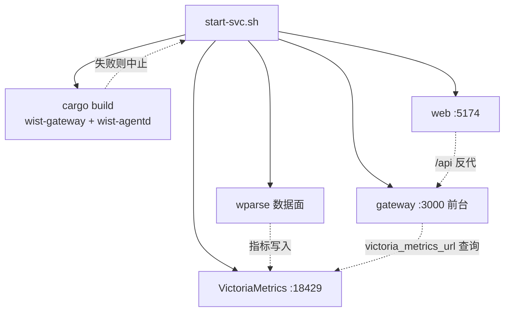

# dev —— 开发态启停脚本

本目录是 wist-gateway-stack 的**开发态**运行方式：不依赖 Docker（VictoriaMetrics 除外），
直接用各仓**本地编译产物**把栈跑起来，对应发布态的 `gops sys start`（见上级 [README](../README.md)）。

目录内只有启停脚本与本地二进制；wparse 业务工程在**栈根的 `../data-plane/`**，与 `dev/` 平级 ——
因为开发态与发布态**共享同一份** wparse 配置（发布态 compose 将它按目录只读挂进容器：
`${WPARSE_WORK_DIR}/conf → /data/conf` 等），所以它不属于开发态，单独放在栈根。
运行态不共享：开发态写 `data-plane/{data,.run}`，发布态写 `../data-plane-run/{data,.run}`（`WPARSE_RUN_DATA` / `WPARSE_RUN_STATE`）。

```
wist-gateway-stack/
  data-plane/     # wparse 工程（conf/connectors/models/topology），开发态与发布态共用
  dev/            # 本目录：开发态启停脚本 + 本地二进制
  sys/            # gops 系统定义（发布态）
```

下文用 `$WIST` 表示各仓的父目录，即本目录的 `../..`：

```
x-topology/wist/                  <- $WIST
  wist-gateway/                    控制面 crate
  wist-agentd/                     采集端 crate
  wist-gateway-web/                前端
  wist-gateway-stack/
    data-plane/                    共用 wparse 工程
    dev/                           <- 本目录
```

> 注意：脚本里的 `ROOT_DIR` 就是 `$WIST`（`dev/../..`），比仓库根 `x-topology` **多一层**。

## 快速开始

```bash
# 一步到位：VictoriaMetrics + wparse + web 转后台常驻，gateway 跑前台
./dev/start-svc.sh

# 只看计划（含各组件当前是否在跑），不启动任何东西
./dev/start-svc.sh --dry-run

# 整栈停止（gateway → web → wparse → VictoriaMetrics）
./dev/stop-svc.sh
```

## 脚本一览

| 脚本 | 起 / 停 | 前台 or 后台 | 停止方式 |
|---|---|---|---|
| `start-svc.sh` | 编排：VM + wparse + web + gateway | 最后 **exec 交接**给 `start-gateway.sh`，gateway 在前台 | `Ctrl+C`（只停 gateway）／`stop-svc.sh`（整栈） |
| `stop-svc.sh` | 按**启动逆序**停四个组件 | — | — |
| `start-gateway.sh` | 控制面 gateway | **前台** | `Ctrl+C`（EXIT trap 一并清理） |
| `start-web.sh` | 前端 vite dev server | 后台常驻（`--foreground` 可前台） | `stop-web.sh` |
| `stop-web.sh` | 停前端 | — | — |
| `start-vm.sh` | VictoriaMetrics（走 Docker） | 后台（容器） | `stop-vm.sh` |
| `stop-vm.sh` | 停 VictoriaMetrics | — | — |
| `start-wparse.sh` | wparse 数据面（工程在 `../data-plane`） | 后台常驻（`--foreground` 可前台） | `stop-wparse.sh` |
| `stop-wparse.sh` | 停 wparse | — | — |
| `re-enroll.sh` | 把本机 wist-agentd 重新注册到网关 | 后台重启 agentd（`--foreground` 可前台） | `wist-agentd/dev/stop.sh` |
| `setup-domain.sh` | 把网关切到某域名（域 = 网关身份） | —（改配置/证书，不起进程） | — |

**没有 `stop-gateway.sh`**：gateway 的设计是前台运行、`Ctrl+C` 停。要停后台跑的 gateway，用
`stop-svc.sh`，或自己 `kill "$(lsof -ti tcp:3000)"`。

## 组件与端口

| 组件 | 开发态地址 | 发布态对应 |
|---|---|---|
| gateway（控制面） | `https://127.0.0.1:3000`（**HTTPS**，自签证书） | `https://<host>:3000` |
| web（前端） | `http://127.0.0.1:5174`（vite，**明文 HTTP**） | `https://<host>:8443`（nginx 终止 TLS） |
| VictoriaMetrics | `http://127.0.0.1:18429`（容器内 8428） | `18429:8428` |
| wparse（数据面） | 无对外端口 | 无对外端口 |
| wist-agentd | 上报到 gateway `:3000` | 同 |

> **端口口径与发布态一致**：gateway 那侧一直是 HTTPS。用 `curl` 排查记得加 `-k` 且用
> `https://`——往 TLS 端口发明文 HTTP 会得到 `Received HTTP/0.9` 这种误导性报错
> （网关日志里是 `failed TLS handshake ... InvalidContentType`）。发布态前端（`8443`）也
> 由 nginx 终止 TLS（`https://<host>:8443`，证书是页面自己的）；开发态前端是 vite 的明文 `5174`。

## 二进制与路径（开发态实际运行的东西）

| 组件 | 二进制 / 入口 | 可覆盖 env |
|---|---|---|
| gateway | `$WIST/wist-gateway/target/debug/wist-gateway` | — |
| wist-agentd | `$WIST/wist-agentd/target/debug/wist-agentd` | `WIST_AGENTD_BIN`（仅 `wist-agentd/dev/start.sh`） |
| wparse | `dev/bin/wparse` | `WPARSE_BIN` |
| web | **不是二进制**：`npm run dev`（实际跑 `node_modules/.bin/vite`），工作目录 `$WIST/wist-gateway-web` | `WEB_DIR` |
| VictoriaMetrics | **无本地二进制**：Docker 镜像 `victoriametrics/victoria-metrics:${VM_TAG}` | `VM_TAG` 等（见 `sys/setting/vars.yml`） |

`start-gateway.sh` 除了起 gateway，还会把 `wist-agentd` 的路径写进配置的 `agent.package_file`
（gateway 启动时校验该文件存在），因此这个二进制也属于本目录的隐式依赖。

### 构建策略

路径全部硬编码 **`target/debug`**，整个 `dev/` 没有一处 `target/release`。

`start-svc.sh` 与 `start-gateway.sh` **每次启动都会 `cargo build`** 两个 crate
（`wist-gateway` / `wist-agentd`），所以跑起来的一定是当前源码。cargo 增量编译在无改动时
几乎瞬时，代价可忽略；编译输出直接透传，编译错误一眼可见。设 `SKIP_BUILD=1` 可跳过
（例如故意要跑现有产物）。

顺序上 `start-svc.sh` 在**起任何组件之前**先构建：编译失败就中止，不会留下
「VM/wparse/web 已起、gateway 却没起」的半栈。

> 为什么不用「缺失才编译」：`if [[ ! -x "$bin" ]]` 意味着**二进制一旦存在就永不重编**，
> 改了 Rust 代码后跑起来仍是旧二进制 —— 典型症状是新接口返回 **404**，极易误判成“服务没起”。
> （唯一例外：`start-wparse.sh` 不构建，因为 wparse 是 `dev/bin/` 里下载来的二进制，非本仓源码。）

## 启动顺序与依赖



`start-svc.sh` 先构建（失败即中止，不起任何组件），再依次拉起组件。
`wparse` 与 `gateway` 都依赖 VictoriaMetrics，`web` 依赖 `gateway`。
`start-svc.sh` 会等 VM 就绪后再继续，并对前 3 个组件做「已在跑则跳过」的幂等判断。

## 日志 / pidfile 速查

| 组件 | 日志 | pidfile |
|---|---|---|
| gateway | `/tmp/wist-gateway-server.log` | `/tmp/wist-gateway.pid`（**包装脚本** `start-gateway.sh` 的 pid） |
| web | `/tmp/wist-gateway-web.log` | `/tmp/wist-gateway-web.pid`（npm 的 pid） |
| wparse | `data-plane/data/logs/wparse-daemon.log`、`wparse.log` | `data-plane/data/logs/wparse.pid` |
| wist-agentd | `~/.wist-agentd/log/agentd.out` | `~/.wist-agentd/log/agentd.pid` |

gateway 的 pidfile 记的是**前台包装脚本**而不是 gateway 进程本身：`stop-svc.sh` 杀这个包装进程，
靠它的 EXIT trap 把 gateway 一起带走——这也是包装脚本必须写 pidfile 的原因。

## 状态与配置目录

| 组件 | 位置 | 内容 |
|---|---|---|
| gateway | `~/.wist-gateway/` | `wist-gateway.toml`；`state/`：SQLite 库、TLS 叶证书与信任锚（`dev-ca.crt.pem`，由 `setup-domain.sh` 建）、Ed25519 签名密钥、`install-package/`（管理面设置的安装包本地缓存）。**与发布态（`configs/gateway/`）分开两个目录** |
| wist-agentd | `~/.wist-agentd/` | `agentd.toml`、`tasks/`、`state/agent_runtime.json`（`wic_` 凭据）、`log/` |
| wparse | `data-plane/{data,.run}/` | 运行期数据与临时产物 |

开发态与发布态的网关持久数据是**分开两个目录**：开发态在 `$HOME/.wist-gateway`，发布态挂 `configs/gateway/`
（两边需要的值不同：`victoria_metrics_url`、`public_base_url`、是否装 `[content]` 等，分开才各自自洽）；
wparse 侧则是**配置共用、运行态分开**：配置在 `data-plane/{conf,connectors,models,topology}`（发布态只读挂载），
运行态开发态在 `data-plane/{data,.run}`、发布态在 `../data-plane-run/`。

网关的注册表存在内嵌 SQLite 里（`state/wist-gateway-store.db`，由 `agent.store_file` 默认值 `.json` 改后缀而来），
启动时自动迁移。若库中**既无 Agent 也无注册 token**，会一次性导入遗留的
`wist-gateway-store.json` 并把它改名为 `*.imported`（防止重复导入）；导入失败只告警，不阻断启动。

## 环境变量覆盖

| 变量 | 作用 | 默认 |
|---|---|---|
| `SKIP_VM` / `SKIP_WPARSE` / `SKIP_WEB` | `start-svc.sh`/`stop-svc.sh` 裁掉某个组件（`=1`） | 不跳过 |
| `SKIP_BUILD` | 跳过 `cargo build`（`start-svc.sh`/`start-gateway.sh`） | 每次都构建 |
| `WIST_GATEWAY_HOME` | 网关配置 + state 目录 | `~/.wist-gateway`（发布态另用 `configs/gateway`） |
| `GATEWAY_LISTEN` | `setup-domain.sh` 写进配置的监听地址 | `0.0.0.0:443` |
| `GATEWAY_URL_PORT` | `setup-domain.sh` 对外基址里的端口（空串 = 不带端口） | 按监听端口推导 |
| `GATEWAY_PIDFILE` | 网关包装脚本 pidfile | `/tmp/wist-gateway.pid` |
| `GATEWAY_PORT` | `stop-svc.sh` 端口兜底用的端口 | `3000` |
| `WEB_URL` | 前端地址（起停两侧必须一致） | `http://127.0.0.1:5174` |
| `WEB_DIR` | 前端目录 | `$WIST/wist-gateway-web` |
| `WEB_LOG` / `WEB_PIDFILE` | 前端日志与 pidfile | `/tmp/wist-gateway-web.log` / `.pid` |
| `WARP_INSIGHT_WEB_PROXY_TARGET` | vite 的 `/api` 反代目标 | `https://localhost:3000` |
| `WPARSE_BIN` | wparse 可执行文件 | `dev/bin/wparse` |
| `WPARSE_WORK_ROOT` | wparse 工程根目录 | `dev/../data-plane` |
| `WPARSE_VM_ENDPOINT` | wparse 写指标的 VM 端点 | `http://127.0.0.1:18429` |
| `WIST_GATEWAY_URL` | `re-enroll.sh` 用的网关地址 | `https://127.0.0.1:3000` |
| `WIST_AGENTD_HOME` | agentd 配置 + 数据目录 | `~/.wist-agentd` |

## 注意事项

1. **启动脚本每次都会 `cargo build`**（见「构建策略」）。这是有意为之：早期用「缺失才编译」时，
   改了 Rust 代码后跑起来的仍是旧二进制，现象是**新接口返回 404**，极易误判成「服务没起」。
   若不想构建（例如故意跑现有产物），设 `SKIP_BUILD=1`。
2. **gateway 是 HTTPS**。排查时用 `https://` + `curl -k`；用 `http://` 会得到 TLS 握手失败。
3. **`stop-web.sh` 的端口兜底会误伤**：它除了按 pidfile 停，还会清理该端口上所有监听进程。
   如果你另外用手工 `npm run dev` 起过一个前端，注意它可能占用的是 Vite 默认的 **5173**，
   而本目录的脚本固定用 **5174**（`--strictPort`）——两者不是同一个实例，别互相误停。
4. **前端反代目标由 `start-web.sh` 从网关配置推导**（取 `[server] listen_addr` 的端口 → `https://127.0.0.1:<port>`；读不到配置才回落 `https://localhost:3000`，可用 `WARP_INSIGHT_WEB_PROXY_TARGET` 覆盖）。target 必须写成 `https://`（`server.proxy` 已设 `secure: false`，不校验自签证书）；写 `http://` 会撞上上面第 2 条的 TLS 握手失败，表现为反代全挂。
5. **`dev/bin/` 不入 git**（约 92M），随发布包也不带。里面只有 `wparse` 被脚本使用；
   `wpadm` / `wpgen` / `wpl-check` / `wprescue` 是**手工 WPL 开发工具**，无脚本引用
   （用法见 `../data-plane/models/wpl/mac/README.md`）。
6. **`../data-plane/` 是 wparse 配置的唯一源**，开发态与发布态共用，且由发布态 compose 按目录只读挂载
   （`${WPARSE_WORK_DIR}/conf → /data/conf` 等）。改它等于同时改两条运行路径；改动后如果影响到变量，
   要重跑 `gops sys update && gops sys localize`。**运行态不共享**：开发态写 `data-plane/{data,.run}`，
   发布态写 `../data-plane-run/{data,.run}`（`WPARSE_RUN_DATA` / `WPARSE_RUN_STATE`）。
7. **同一 work root 只能跑一个 wparse 引擎**（引擎自身没有单实例保护，实测两个实例会互写
   `.run/authority.sqlite` 与输出，你的 46G `out_dat` 就是这么长出来的）。两道保障：
   - `start-wparse.sh` 先拿**与容器同一位置**的锁 `<work-root>/.run/.wparse.lock`（macOS 没有 `flock(1)`，用 python3
     的 `fcntl`，锁 fd 设成可继承才能跨 `exec` 存活）——锁拿不到立刻退出（75）；
   - 另用 `docker ps --filter volume=<work-root>` 探测有没有容器挂着同一个 work root。
  已知边界：macOS 上容器与宿主**不共享** flock（work root 是 virtiofs，guest 内的锁不落到宿主内核），
  所以**反方向拦不住**（dev 先起、容器后起会两边都跑）；默认靠运行态目录隔离就不会撞。
8. **`stop-wparse.sh` 只在 `ps` 确认 pid 确实是 wparse 时才 kill**：pidfile 可能被别的进程写过
   （典型：容器把 `pid=1` 写进共享 work root 时，盲 `kill` 会去杀 launchd/systemd）——已加护栏，
   发现不对会拒绝并提示 `拒绝 kill：/sbin/launchd`。
9. **`re-enroll.sh` 需要网关已在跑**，并从 `~/.wist-gateway/wist-gateway.toml` 读
   `admin_api_token` 去签发 enrollment token；它只修 agentd 侧，不动网关。
10. **`start-svc.sh` 放后台跑时，`Ctrl+C` 管不到 gateway**：此时用 `stop-svc.sh`，
   它靠 pidfile + 端口兜底来停。
11. **信任锚走文件，且通常是 CA 根**：配置里是 `[agent] trust_bundle_file`（相对配置目录）。
   `start-gateway.sh` 每次启动把它指向 `state/dev-ca.crt.pem`（跑过 `setup-domain.sh` 就有这张小 CA），
   没有 CA 时才退回叶证书自身 `state/admin-tls.crt.pem`。旧的 `trust_bundle = """…"""` 内联写法已移除。
   叶证书是 `CA:FALSE` 形态（`CA:TRUE` 会被 rustls 以 `CaUsedAsEndEntity` 拒收）。**只要锚（CA）不变，
   轮换叶证书 / 换域名是安全的**，agent 无感；只有**锚变了**（换 CA、删掉 `dev-ca.*` 重生成，
   或一直在无 CA 模式下换了叶证书）才需要**重跑安装**刷新 agentd 内嵌的 `trust_bundle`
   （仅 `./dev/re-enroll.sh` 不刷新它）。

## 目录

```
dev/
  README.md                     # 本文件
  start-svc.sh / stop-svc.sh    # 开发态一站式：起/停 全栈
  start-gateway.sh              # 仅启控制面 backend（前台，写 pidfile 供 stop-svc.sh）
  start-web.sh / stop-web.sh    # 仅启/停前端 vite dev server
  start-vm.sh / stop-vm.sh      # 仅启/停 VictoriaMetrics（走 Docker）
  start-wparse.sh / stop-wparse.sh   # 仅启/停数据面（工程在 ../data-plane）
  re-enroll.sh                  # 重注册本机 wist-agentd 到网关
  setup-domain.sh               # 把网关切到某域名（建/复用 dev CA + 签叶证书 + 改配置）
  bin/                          # wparse 等本地二进制（不入 git）

../data-plane/                  # wparse 工程（开发态与发布态共用的唯一源，不属 dev）
  conf/ connectors/ topology/ models/
```
