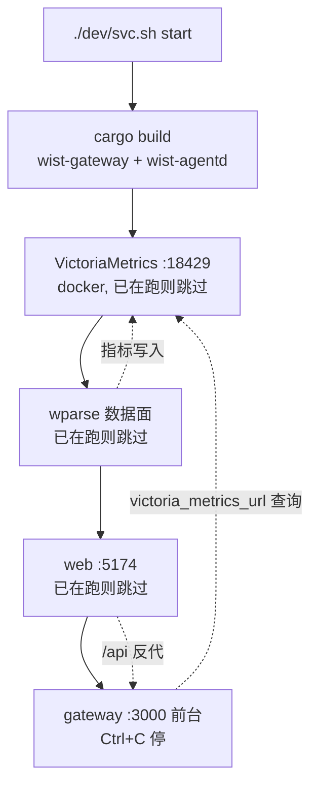

# dev —— 开发态启停（单一入口 `svc.sh`）

本目录是 wist-gateway-stack 的**开发态**运行方式：不依赖 Docker（VictoriaMetrics 除外），
直接用各仓**本地编译产物**把栈跑起来，对应发布态的 `gops sys start|stop|status`（见上级 [README](../README.md)）。

**入口只有一个：`./dev/svc.sh`**。9 个分散的 start/stop 脚本已合并成它一个 —— 起/停/看全在里面，
「什么被自动执行、什么不用」只在一处定义。

```
wist-gateway-stack/
  data-plane/     # wparse 工程（conf/connectors/models/topology），开发态与发布态共用
  dev/            # 本目录：svc.sh + 一次性工具 + 本地二进制
  sys/            # gops 系统定义（发布态）
```

下文用 `$WIST` 表示各仓父目录，即本目录的 `../..`：

```
x-topology/wist/                  <- $WIST
  wist-gateway/                    控制面 crate
  wist-agentd/                     采集端 crate
  wist-gateway-web/                前端
  wist-gateway-stack/
    data-plane/                    共用 wparse 工程
    dev/                           <- 本目录（ROOT_DIR = $WIST，比栈根多一层）
```

## 快速开始

```bash
# 起全栈（日常）：构建一次 → VM/wparse/web 后台 → gateway 前台
./dev/svc.sh start

# 只看计划，不启动
./dev/svc.sh start --dry-run

# 看四个组件当前状态
./dev/svc.sh status

# 停全栈（逆序：gateway → web → wparse → VM）
./dev/svc.sh stop
```

## 场景 → 跑哪个（决策树）

| 我要… | 命令 |
|---|---|
| 起全栈（日常） | `./dev/svc.sh start` |
| 停全栈 | `./dev/svc.sh stop` |
| 看状态 | `./dev/svc.sh status` |
| 只重启前端（gateway 已在跑） | `./dev/svc.sh start web` |
| 只停/起某个组件 | `./dev/svc.sh stop web` / `./dev/svc.sh start gateway --no-build` |
| 换域名 | `./dev/setup-domain.sh <域名>`（改配置 + 重签证书，**改完需重启 gateway**） |

> **不要**再去找 `start-web.sh` / `stop-vm.sh` / `re-enroll.sh` 之类的单组件或重注册脚本 —— 前者已并入
> `svc.sh`。**本机 agentd 的重新注册不需要脚本**：网关库丢了 / 换域名时，持有效客户端证书的 agent 会
> **自动**重新登记（mTLS 自愈）；真要手动重注册，用 `wist-agentd` 自带的 `enroll`。
> `svc.sh start` 会把 `vm`/`wparse`/`web`/`gateway` 按序起全（已在跑的跳过），你不用逐个跑。

## 组件与脚本

`svc.sh` 管四个组件（顺序 = 依赖序）：

| 组件 | 是什么 | 前台/后台 | 说明 |
|---|---|---|---|
| `vm` | VictoriaMetrics（`18429`） | 后台（**Docker 容器**） | 第三方依赖，无本地二进制；走 `sys/docker-compose.yml` |
| `wparse` | 数据面 ELT 引擎 | 后台常驻 | 本地 `dev/bin/wparse`；工程在 `../data-plane` |
| `web` | 前端 vite dev server（`5174`） | 后台常驻 | `npm run dev`，工作目录 `$WIST/wist-gateway-web` |
| `gateway` | 控制面后端（HTTPS `:3000`） | **前台**（Ctrl+C 停） | 跑在最后；其余组件不随其退出而停 |

**没有单独的 `stop-gateway.sh`**：gateway 前台运行、`Ctrl+C` 停；后台跑时用 `svc.sh stop gateway`
（靠 pidfile + 端口兜底停）。

## 二进制与路径（开发态实际运行的东西）

| 组件 | 二进制 / 入口 | 可覆盖 env |
|---|---|---|
| gateway | `$WIST/wist-gateway/target/debug/wist-gateway` | — |
| web | **不是二进制**：`npm run dev`（实际跑 `node_modules/.bin/vite`），工作目录 `$WIST/wist-gateway-web` | `WEB_DIR` |
| wparse | `dev/bin/wparse` | `WPARSE_BIN` |
| VictoriaMetrics | **无本地二进制**：Docker 镜像 `victoriametrics/victoria-metrics:${VM_TAG}` | `VM_TAG` 等（见 `sys/setting/vars.yml`） |
| wist-agentd | `$WIST/wist-agentd/target/debug/wist-agentd` | `WIST_AGENTD_BIN`（仅 `wist-agentd/dev/start.sh`） |

`svc.sh start gateway` 会把 `wist-agentd` 的路径写进网关配置的 `agent.package_file`
（gateway 启动时校验该文件存在），因此这个二进制也属于本目录的隐式依赖。

### 构建策略

路径全部硬编码 **`target/debug`**，整个 `dev/` 没有一处 `target/release`。

`svc.sh start` **每次启动都会 `cargo build` 一次**两个 crate（`wist-gateway` / `wist-agentd`），
所以跑起来的一定是当前源码。cargo 增量编译在无改动时几乎瞬时；编译输出直接透传，编译错误一眼可见。
`--no-build`（或 `SKIP_BUILD=1`）跳过。

**先构建、再起组件**：编译失败就中止，不会留下「VM/wparse/web 已起、gateway 却没起」的半栈。

> 为什么不用「缺失才编译」：`if [[ ! -x "$bin" ]]` 意味着**二进制一旦存在就永不重编**，改了 Rust
> 代码后跑起来仍是旧二进制 —— 典型症状是新接口返回 **404**，极易误判成“服务没起”。
> （wparse 不构建：它是 `dev/bin/` 里下载来的二进制，非同仓源码。）

## 启动顺序与依赖



`wparse` 与 `gateway` 都依赖 VictoriaMetrics，`web` 依赖 `gateway`。
`start` 会等 VM 就绪再继续，且对每个组件做「已在跑则跳过」的幂等判断。

## 日志 / pidfile 速查

| 组件 | 日志 | pidfile |
|---|---|---|
| gateway | `/tmp/wist-gateway-server.log` | `/tmp/wist-gateway.pid`（**承载进程** `svc.sh start gateway` 的 pid） |
| web | `/tmp/wist-gateway-web.log` | `/tmp/wist-gateway-web.pid`（npm 的 pid） |
| wparse | `data-plane/data/logs/wparse-daemon.log`、`wparse.log` | `data-plane/data/logs/wparse.pid` |
| wist-agentd | `~/.wist-agentd/log/agentd.out` | `~/.wist-agentd/log/agentd.pid` |

gateway 的 pidfile 记的是**前台承载进程**（`svc.sh`）而不是 gateway 进程本身：`svc.sh stop gateway`
杀这个进程，靠它的 EXIT trap 把 gateway 一起带走；再加端口兜底（只 kill 确认是 `wist-gateway` 的进程）。

## 状态与配置目录

| 组件 | 位置 | 内容 |
|---|---|---|
| gateway | `~/.wist-gateway/` | `wist-gateway.toml`；`state/`：SQLite 库、TLS 叶证书与信任锚（`gateway-ca.crt.pem`）、Ed25519 签名密钥、`install-package/` |
| wist-agentd | `~/.wist-agentd/` | `agentd.toml`、`tasks/`、`state/agent_runtime.json`（`wic_` 凭据）、`log/` |
| wparse | `data-plane/{data,.run}/` | 运行期数据与临时产物 |

**开发态与发布态的网关持久数据是分开两个目录**：开发态在 `~/.wist-gateway`，发布态挂
`configs/gateway/`（两边 `victoria_metrics_url`、`public_base_url`、是否装 `[content]` 等不同，分开才各自自洽）。
wparse 侧则是**配置共用、运行态分开**：配置在 `data-plane/{conf,connectors,models,topology}`（发布态只读挂载），
运行态开发态在 `data-plane/{data,.run}`、发布态在 `../data-plane-run/`。

网关注册表存在内嵌 SQLite 里（`state/wist-gateway-store.db`，由 `agent.store_file` 默认值 `.json`
改后缀而来），启动时自动迁移。若库中**既无 Agent 也无注册 token**，会一次性导入遗留的
`wist-gateway-store.json` 并改名为 `*.imported`；导入失败只告警，不阻断启动。

> **备份/恢复**：身份 PEM 不可再生，必备；**库**里存着 agent 的**凭据**（bearer token）—— 要让老 agent
> 无感回来必须连库一起搬（`--level restore` + `--no-config`，或直接用 `scripts/promote-dev-identity.sh`）。
> `./scripts/backup-gateway.sh --from ~/.wist-gateway`；详见根 README「备份与恢复」。

## 环境变量覆盖

| 变量 | 作用 | 默认 |
|---|---|---|
| `SKIP_BUILD` | 等价 `--no-build`（跳过 `cargo build`） | 每次都构建 |
| `WIST_GATEWAY_HOME` | 网关配置 + state 目录 | `~/.wist-gateway`（发布态另用 `configs/gateway`） |
| `GATEWAY_PIDFILE` | 网关承载进程 pidfile | `/tmp/wist-gateway.pid` |
| `GATEWAY_PORT` | `stop gateway` 端口兜底用的端口 | `3000` |
| `WEB_URL` | 前端地址（起停两侧必须一致） | `http://127.0.0.1:5174` |
| `WEB_DIR` | 前端目录 | `$WIST/wist-gateway-web` |
| `WEB_LOG` / `WEB_PIDFILE` | 前端日志与 pidfile | `/tmp/wist-gateway-web.log` / `.pid` |
| `WARP_INSIGHT_WEB_PROXY_TARGET` | vite 的 `/api` 反代目标 | 从网关配置推导（见下） |
| `WPARSE_BIN` | wparse 可执行文件 | `dev/bin/wparse` |
| `WPARSE_WORK_ROOT` | wparse 工程根目录 | `dev/../data-plane` |
| `WPARSE_VM_ENDPOINT` | wparse 写指标的 VM 端点 | `http://127.0.0.1:18429` |
| `WPARSE_GATEWAY_ENDPOINT` | wparse 的 agent-facts sink 端点 | `http://127.0.0.1:3001` |
| `GATEWAY_LISTEN` | `setup-domain.sh` 写进配置的监听地址 | `0.0.0.0:443` |
| `GATEWAY_URL_PORT` | `setup-domain.sh` 对外基址里的端口（空串 = 不带端口） | 按监听端口推导 |

## 注意事项

1. **gateway 是 HTTPS**。排查时用 `https://` + `curl -k`；用 `http://` 会得到 TLS 握手失败
   （`Received HTTP/0.9`，网关日志是 `failed TLS handshake … InvalidContentType`）。
2. **前端反代目标由 `svc.sh` 从网关配置推导**（取 `[server] listen_addr` 的端口 →
   `https://127.0.0.1:<port>`；读不到配置才回落 `https://localhost:3000`，可用
   `WARP_INSIGHT_WEB_PROXY_TARGET` 覆盖）。target 必须写成 `https://`（`server.proxy` 已设
   `secure: false`，不校验自签证书）；写 `http://` 会撞上第 1 条的 TLS 握手失败，表现为反代全挂。
3. **`stop web` 的端口兜底会误伤**：它除了按 pidfile 停，还会清理该端口上所有监听进程。若你另外手工
   `npm run dev` 起过前端，注意它可能是 Vite 默认的 **5173**（本目录固定 **5174** `--strictPort`），
   两者不是同一个实例，别互相误停。
4. **`dev/bin/` 不入 git**（约 92M），随发布包也不带。里面只有 `wparse` 被脚本使用；`wpadm` / `wpgen`
   / `wpl-check` / `wprescue` 是**手工 WPL 开发工具**，无脚本引用（见 `../data-plane/models/wpl/mac/README.md`）。
5. **`../data-plane/` 是 wparse 配置的唯一源**，开发态与发布态共用，且由发布态 compose 按目录只读挂载
   （`${WPARSE_WORK_DIR}/conf → /data/conf` 等）。改它等于同时改两条运行路径；改动后若影响变量，
   要重跑 `gops sys update && gops sys localize`。**运行态不共享**：开发态写 `data-plane/{data,.run}`，
   发布态写 `../data-plane-run/{data,.run}`（`WPARSE_RUN_DATA` / `WPARSE_RUN_STATE`）。
6. **同一 work root 只能跑一个 wparse 引擎**（引擎自身没有单实例保护，实测两个实例会互写
   `.run/authority.sqlite` 与输出）。两道保障：`svc.sh` 先拿**与容器同一位置**的锁
   `<work-root>/.run/.wparse.lock`（macOS 没 `flock(1)`，用 python3 的 `fcntl`，锁 fd 设成可继承才能跨
   `exec` 存活）——拿不到立刻退出（75）；另用 `docker ps --filter volume=<work-root>` 探测有没有容器挂着。
   已知边界：macOS 上容器与宿主**不共享** flock（work root 是 virtiofs），**反方向拦不住**（dev 先起、
   容器后起会两边都跑）；默认靠运行态目录隔离就不会撞。
7. **停 wparse 只在 `ps` 确认 pid 确实是 wparse 时才 kill**：pidfile 可能被别的进程写过（典型：容器把
   `pid=1` 写进共享 work root 时，盲 `kill` 会去杀 launchd/systemd）——已加护栏，发现不对会拒绝并提示。
8. **`setup-domain.sh` 要求 gateway 已起过**（需配置存在）；它是**按需一次性工具**，不属于 `svc.sh start` 流程。
   本机 agentd 的重新注册**不需要专门脚本**：持有效客户端证书的 agent 会在网关库丢失/换域名时**自动**重新登记（mTLS 自愈）；真要手动重注册，用 `wist-agentd` 自带的 `enroll`。
9. **信任锚走文件，且通常是 CA 根**：配置里是 `[agent] trust_bundle_file`（相对配置目录）。`svc.sh`
   每次启动把它指向 `state/gateway-ca.crt.pem`（跑过 `setup-domain.sh` 就有这张小 CA），没有 CA 时才退回叶证书
   自身 `state/admin-tls.crt.pem`。旧的 `trust_bundle = """…"""` 内联写法已迁移（新配置不认它，留着会以
   `missing field trust_bundle_file` 起不来）。叶证书是 `CA:FALSE` 形态（`CA:TRUE` 会被 rustls 以
   `CaUsedAsEndEntity` 拒收）。**只要锚（CA）不变，轮换叶证书 / 换域名是安全的**，agent 无感；
   只有**锚变了**（换 CA、删掉 `gateway-ca.*` 重生成）才需要**重跑安装**刷新 agentd 内嵌的 `trust_bundle`
   （仅重新注册/enroll 不刷新它）。
10. **`setup-domain.sh` 只改配置/证书，不重启 gateway**：改完记得 `./dev/svc.sh stop gateway && ./dev/svc.sh start gateway`。

## 目录

```
dev/
  README.md                     # 本文件
  svc.sh                        # 唯一入口：start / stop / status（管 vm/wparse/web/gateway）
  setup-domain.sh               # 按需：把网关切到某域名（建/复用 dev CA + 签叶证书 + 改配置）
  bin/                          # wparse 等本地二进制（不入 git）

../data-plane/                  # wparse 工程（开发态与发布态共用的唯一源，不属 dev）
  conf/ connectors/ topology/ models/
```
