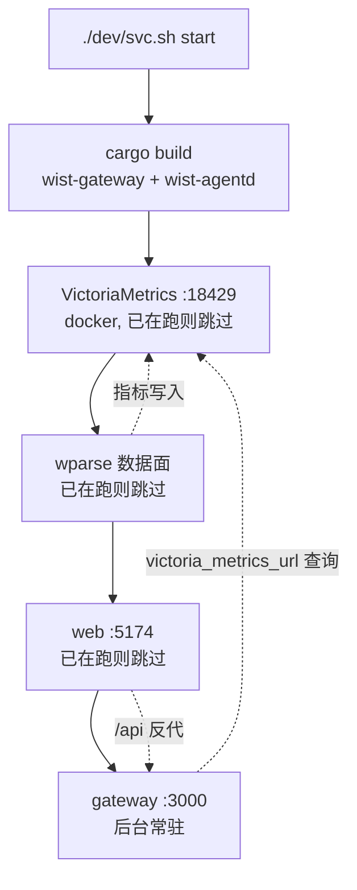

# dev —— 开发态启停（单一入口 `svc.sh`）

本目录是 wist-gateway-stack 的**开发态**运行方式：不依赖 Docker（VictoriaMetrics 除外），
直接用各仓**本地编译产物**把栈跑起来，对应发布态的 `gops run start|stop|status`（见上级 [README](../README.md)）。

**入口只有一个：`./dev/svc.sh`**。9 个分散的 start/stop 脚本已合并成它一个 —— 起/停/看全在里面，
「什么被自动执行、什么不用」只在一处定义。

```
wist-gateway-stack/
  data-plane/     # wparse 工程（conf/connectors/models/topology），开发态与发布态共用
  dev/            # 本目录：svc.sh + 一次性工具 + 本地二进制
  sys/            # gops 系统定义（发布态）
```

下文用 `$WIST` 表示各仓父目录，即本目录的 `../..`：

```
x-topology/wist/                  <- $WIST
  wist-gateway/                    控制面 crate
  wist-agentd/                     采集端 crate
  wist-gateway-web/                前端
  wist-gateway-stack/
    data-plane/                    共用 wparse 工程
    dev/                           <- 本目录（ROOT_DIR = $WIST，比栈根多一层）
```

## 快速开始

```bash
# 起全栈（日常）：构建一次 → 六个组件全部后台常驻（VM/wparse/web/forward/gateway/gwlinkd）
./dev/svc.sh start

# 只看计划，不启动
./dev/svc.sh start --dry-run

# 看各组件当前状态
./dev/svc.sh status

# 停全栈（逆序：gwlinkd → gateway → forward → web → wparse → VM）
./dev/svc.sh stop
```

## 场景 → 跑哪个（决策树）

| 我要… | 命令 |
|---|---|
| 起全栈（日常） | `./dev/svc.sh start` |
| 停全栈 | `./dev/svc.sh stop` |
| 看状态 | `./dev/svc.sh status` |
| 只重启前端（gateway 已在跑） | `./dev/svc.sh start web` |
| 只停/起某个组件 | `./dev/svc.sh stop web` / `./dev/svc.sh start gateway --no-build` |
| 换域名 | `./dev/setup-domain.sh <域名>`（改配置 + 重签证书，**改完需重启 gateway**） |
| 不要 agent 面 / 不想碰 sudo | `./dev/svc.sh start --no-forward` |
| 把本机网关接入本机中心 | `./dev/link_local_center.sh`（快速路）或 `--via-gateway`（页面路，见「接入上级」一节） |

> **不要**再去找 `start-web.sh` / `stop-vm.sh` / `re-enroll.sh` 之类的单组件或重注册脚本 —— 前者已并入
> `svc.sh`。**本机 agentd 的重新注册不需要脚本**：网关库丢了 / 换域名时，持有效客户端证书的 agent 会
> **自动**重新登记（mTLS 自愈）；真要手动重注册，用 `wist-agentd` 自带的 `enroll`。
> `svc.sh start` 会把 `vm`/`wparse`/`web`/`forward`/`gateway` 按序起全（已在跑的跳过），你不用逐个跑。

## 组件与脚本

`svc.sh` 管六个组件（顺序 = 依赖序）；`forward` 与 `gwlinkd` 在默认 `start` 里，可分别用
`--no-forward` / `--no-gwlinkd` 摘掉：

| 组件 | 是什么 | 前台/后台 | 说明 |
|---|---|---|---|
| `vm` | VictoriaMetrics（`18429`） | 后台（**Docker 容器**） | 第三方依赖，无本地二进制；走 `sys/docker-compose.yml` |
| `wparse` | 数据面 ELT 引擎 | 后台常驻 | 本地 `dev/bin/wparse`；工程在 `../data-plane` |
| `web` | 前端 vite dev server（`5174`） | 后台常驻 | `npm run dev`，工作目录 `$WIST/wist-gateway-web` |
| `gateway` | 控制面后端（HTTPS `:3000`） | 后台常驻 | 跑在最后；`./dev/svc.sh stop gateway` 停 |
| `forward` | `443 → 网关端口` 纯 TCP 转发 | 后台常驻 | **在默认 `start` 里**（绑 443 要 sudo；`--no-forward` 摘掉）；见下面「组件 forward」一节 |
| `gwlinkd` | 网关**宿主侧**常驻：接入上级控制中心 | 后台常驻 | **在默认 `start` 里**（轮询网关、消费「链接上级」页请求；`--no-gwlinkd` 摘掉）；委托 `dev/link_local_center.sh --via-gateway`；见「接入上级」一节 |

**六个组件都是后台常驻**：`./dev/svc.sh start` 起完就返回，不会占住终端；停用 `./dev/svc.sh stop`
（`stop gateway` 会一并停掉 443 转发 —— 网关都停了，那个 443 只会让人看到 transport error）。

## 二进制与路径（开发态实际运行的东西）

| 组件 | 二进制 / 入口 | 可覆盖 env |
|---|---|---|
| gateway | `$WIST/wist-gateway/target/debug/wist-gateway` | — |
| web | **不是二进制**：`npm run dev`（实际跑 `node_modules/.bin/vite`），工作目录 `$WIST/wist-gateway-web` | `WEB_DIR` |
| wparse | `dev/bin/wparse` | `WPARSE_BIN` |
| VictoriaMetrics | **无本地二进制**：Docker 镜像 `victoriametrics/victoria-metrics:${VM_TAG}` | `VM_TAG` 等（见 `sys/setting/vars.yml`） |
| wist-agentd | `$WIST/wist-agentd/target/debug/wist-agentd` | `WIST_AGENTD_BIN`（仅 `wist-agentd/dev/start.sh`） |

`wist-agentd` 的二进制**不再是网关配置项**（`agent.package_file` 已删）：安装包只有「管理面录入」
一个来源。dev 态要发安装命令时，到「安装包」页把本地来源填成它的宿主路径
（`$WIST/wist-agentd/target/debug/wist-agentd`）录入一次即可；录制会持久化在库里，不必每次重启再录。

### 构建策略

路径全部硬编码 **`target/debug`**，整个 `dev/` 没有一处 `target/release`。

`svc.sh start` **每次启动都会 `cargo build` 一次**两个 crate（`wist-gateway` / `wist-agentd`），
所以跑起来的一定是当前源码。cargo 增量编译在无改动时几乎瞬时；编译输出直接透传，编译错误一眼可见。
`--no-build`（或 `SKIP_BUILD=1`）跳过。

**先构建、再起组件**：只有**编译失败**才中止（没二进制后面无从谈起）。单个后台组件起不来**只 WARN、不中止整栈**
—— 组件之间互不为「启动前置」，一个慢/坏的前端不该挡住网关；会打一行**启动小结**，`status` 可复核。

> 为什么不用「缺失才编译」：`if [[ ! -x "$bin" ]]` 意味着**二进制一旦存在就永不重编**，改了 Rust
> 代码后跑起来仍是旧二进制 —— 典型症状是新接口返回 **404**，极易误判成“服务没起”。
> （wparse 不构建：它是 `dev/bin/` 里下载来的二进制，非同仓源码。）

## 启动顺序与依赖



`wparse` 与 `gateway` 都依赖 VictoriaMetrics，`web` 依赖 `gateway`。这些是**运行期**依赖，**都不是启动前置**。
`start` **不把就绪检查当硬门槛**：任一后台组件起不来只 **WARN、不中止整栈**（慢/坏的前端不该挡住网关）；
`web` 更完全不等待（pull：只有人开浏览器才用），就绪交给 `status`。`gateway` 也后台，排在最后起。

## 日志 / pidfile 速查

| 组件 | 日志 | pidfile |
|---|---|---|
| gateway | `/tmp/wist-gateway-server.log` | `/tmp/wist-gateway.pid`（**网关进程自身**的 pid） |
| web | `/tmp/wist-gateway-web.log` | `/tmp/wist-gateway-web.pid`（npm 的 pid） |
| wparse | `data-plane/data/logs/wparse-daemon.log`、`wparse.log` | `data-plane/data/logs/wparse.pid` |
| wist-agentd | `~/.wist-agentd/log/agentd.out` | `~/.wist-agentd/log/agentd.pid` |

gateway 的 pidfile 记的是**网关进程自身**的 pid（后台常驻，与 web/wparse 同一口径）：`svc.sh stop gateway`
直接 `kill` 它，再加端口兜底（只 kill 确认是 `wist-gateway` 的进程）。

## 状态与配置目录

| 组件 | 位置 | 内容 |
|---|---|---|
| gateway | `dev/configs/gateway/`（= `$WIST_GATEWAY_HOME`，默认） | `wist-gateway.toml`；`state/`：SQLite 库、TLS 叶证书与信任锚（`gateway-ca.crt.pem`）、Ed25519 签名密钥、`install-package/` |
| wist-agentd | `~/.wist-agentd/` | `agentd.toml`、`tasks/`、`state/agent_runtime.json`（`wic_` 凭据）、`log/` |
| wparse | `data-plane/{data,.run}/` | 运行期数据与临时产物 |

**开发态与发布态的网关持久数据是分开两个目录**：开发态在 `<栈根>/dev/configs/gateway`，发布态挂
`configs/gateway/`（两边 `victoria_metrics_url`、`public_base_url`、是否装 `[content]` 等不同，分开才各自自洽）。

> ⚠️ 两边的 `admin_api_token` **不同**：登录开发态页面（`web`，默认 `:5174`）要用
> **开发态** `dev/configs/gateway/wist-gateway.toml` 里那个，**不是**发布态容器用的
> `configs/gateway/wist-gateway.toml`（两份同名、都是 `.gitignore` 的本地生成物，容易拿错）。
> 别翻文件：`./dev/svc.sh token`（只认开发态 home，顺带打印 token 出处）。
wparse 侧则是**配置共用、运行态分开**：配置在 `data-plane/{conf,connectors,models,topology}`（发布态只读挂载），
运行态开发态在 `data-plane/{data,.run}`、发布态在 `../data-plane-run/`。

网关注册表存在内嵌 SQLite 里（`state/wist-gateway-store.db`，由 `agent.store_file` 默认值 `.json`
改后缀而来），启动时自动迁移。若库中**既无 Agent 也无注册 token**，会一次性导入遗留的
`wist-gateway-store.json` 并改名为 `*.imported`；导入失败只告警，不阻断启动。

> **备份/恢复**：身份 PEM 不可再生，必备；**库**里存着 agent 的**凭据**（bearer token）—— 要让老 agent
> 无感回来必须连库一起搬（`--level restore` + `--no-config`，或直接用 `scripts/promote-dev-identity.sh`）。
> `./scripts/backup-gateway.sh --from <栈根>/dev/configs/gateway`；详见根 README「备份与恢复」。

## 环境变量覆盖

| 变量 | 作用 | 默认 |
|---|---|---|
| `SKIP_BUILD` | 等价 `--no-build`（跳过 `cargo build`） | 每次都构建 |
| `SKIP_FORWARD` | 等价 `--no-forward`（整个摘掉 `forward`） | 不摘 |
| `WIST_GATEWAY_HOME` | 网关配置 + state 目录 | `<栈根>/dev/configs/gateway`（发布态另用 `configs/gateway`） |
| `GATEWAY_PIDFILE` | 网关进程 pidfile | `/tmp/wist-gateway.pid` |
| `GATEWAY_PORT` | `stop gateway` 端口兜底用的端口 | `3000` |
| `WEB_URL` | 前端地址（起停两侧必须一致） | `http://127.0.0.1:5174` |
| `WEB_DIR` | 前端目录 | `$WIST/wist-gateway-web` |
| `WEB_LOG` / `WEB_PIDFILE` | 前端日志与 pidfile | `/tmp/wist-gateway-web.log` / `.pid` |
| `WARP_INSIGHT_WEB_PROXY_TARGET` | vite 的 `/api` 反代目标 | 从网关配置推导（见下） |
| `WPARSE_BIN` | wparse 可执行文件 | `dev/bin/wparse` |
| `WPARSE_WORK_ROOT` | wparse 工程根目录 | `dev/../data-plane` |
| `WPARSE_VM_ENDPOINT` | wparse 写指标的 VM 端点 | `http://127.0.0.1:18429` |
| `WPARSE_GATEWAY_ENDPOINT` | wparse 的 agent-facts sink 端点 | `http://127.0.0.1:3001` |
| `GATEWAY_LISTEN` | `setup-domain.sh` 写进配置的监听地址 | `0.0.0.0:443` |
| `GATEWAY_URL_PORT` | `setup-domain.sh` 对外基址里的端口（空串 = 不带端口） | 按监听端口推导 |
| `FORWARD_LISTEN` | `forward` 组件监听的端口（**起/停/status 三侧必须一致**） | `443` |
| `FORWARD_BIND` | `forward` 绑定地址 | `0.0.0.0` |
| `FORWARD_TARGET_PORT` | `forward` 的转发目标端口 | 按网关配置推导 |
| `FORWARD_PIDFILE` / `FORWARD_LOG` | 转发器 pidfile / 日志 | `/tmp/wist-gateway-forward.pid` / `.log` |
| `FORWARD_SCRIPT` | 转发器脚本（纯 TCP，不碰 TLS） | `dev/forward-443.py` |

## 组件 `forward`：让 agent 也走 443（补发布态由 docker 提供的那一跳）

发布态 agentd 连的 `https://<域名>`（隐式 **443**）不是网关进程自己听的 —— 那是 compose 里
`${GATEWAY_PORT}:3000` 这行**端口映射**给的。dev 态没有 docker，网关按配置听高位端口（默认
`3000`），于是 agent 侧只剩“域名:3000”可填 —— 那就不是发布态那个形态了。

`forward` 就是这个缺口：一个**纯 TCP** 转发器（TLS 仍由网关终止，证书/信任锚/SNI 全部原样透传，
agent 侧地址不必带端口）。**它是默认 `start` 的一部分** —— “agent 能不能连上来”是日常问题，
不该靠人记得敲第二个命令；所以 `./dev/svc.sh start` 就会把它带上（`start [组件…]` 点名了别的组件时不带）。

```bash
./dev/svc.sh start              # 含 forward：443 → 网关监听端口
./dev/svc.sh start forward      # 只要它（网关已在跑、只补这一跳）
./dev/svc.sh stop  forward      # 只停它（root 起的会自己退回 sudo）
```

> 起没起的判据是**进程存活**（pidfile + `ps`），**不是**`lsof` 看 443 在没在听 —— 转发器是 root 起的，
> 非 root 的 `lsof` 看不见别人的监听 socket，拿它当就绪判据会永远误报。

**sudo 怎么处理**（绑 <1024 的端口要 root，但这件事不该把整次 `start` 拖死）：三级降级 ——
免密 sudo → 交互终端上要一次密码（会明确告知为什么）→ 实在要不到就**跳过并告诉你**，
栈照旧起来。只要它（`start forward`）时则是硬错误：那是你点名要的东西。

两件要知道的事：

1. **`FORWARD_LISTEN` 起停两侧必须一致**（同 `WEB_URL` 的口径）：`status`/`stop` 看的是它。
2. **网关看到的对端地址会变成 `127.0.0.1`** —— 所有 agent 挤进同一个限流桶，日志里也看不出真实
   来源（这是“纯转发”的代价）。**要保真实源 IP** 就别用它（`--no-forward`），改用内核级重定向
   （`sudo sh -c 'printf "rdr pass on lo0 inet proto tcp from any to 127.0.0.1 port 443 ->\
   127.0.0.1 port 3000\n" | pfctl -ef -'`，撤销 `sudo pfctl -F all -f /etc/pf.conf`）。

另一条路：**让网关自己就听 443**（`GATEWAY_LISTEN=0.0.0.0:443 ./dev/setup-domain.sh <域名>` +
`sudo ./dev/svc.sh start gateway --no-forward`）—— 与发布态完全一致、也不需要转发器、还保真实
源 IP，但网关会以 **root** 跑，它写的 `state/*`（库、`knowledge/`、日志）都变成 root 所有，
之后普通用户的 dev 会踩权限。

## 接入上级（控制中心）：`svc.sh` 的 `gwlinkd` 组件 + `link_local_center.sh`

> **默认 `./dev/svc.sh start` 已经把页面路 gwlinkd 带起来了** —— 日常不用再手跑下面的命令；
> 只想单独起/停它就 `./dev/svc.sh start gwlinkd` / `./dev/svc.sh stop gwlinkd`。

`svc.sh` 管的是**本机网关栈自己**；把网关**接入上级（控制中心）**是另一件事，由 `gwlinkd` 承担：
它是网关**宿主侧**的容器外常驻（设计 `gateway-secure-registration.md`，CR-003），**随网关走**，
所以脚本在本仓 `dev/`（不是 center-stack）。两条路：

- **快速路（默认）**：脚本直接建/复用中心实例 + 取一次性接入券 + 起 gwlinkd（**不经**网关页）。
- **页面路 `--via-gateway`**：让 gwlinkd **轮询网关**「链接上级」页提交的接入请求 —— 真产品路径。

```bash
# 前提：本机中心已在跑（wist-center-stack 的 ./dev/svc.sh start，默认 https://127.0.0.1:3100）

# 快速路：建/复用中心实例 + 取一次性接入券 + 写 gwlinkd.toml + 后台跑
./dev/link_local_center.sh

# 页面路：先在本机网关页「链接上级」粘贴接入链接，再起 gwlinkd 去拉取
GATEWAY_ID=gw-002 ./dev/link_local_center.sh --via-gateway

./dev/link_local_center.sh --stop   # 停 gwlinkd
```

快速路做的事：构建 `wist-gwlinkd` → 调中心 admin API 建/复用实例并取接入券 → 写
`<home>/gwlinkd.toml` → 后台跑 gwlinkd：`link-upstream` → `register`（换客户端证书）→ 周期 `status`（此后 mTLS）。

**页面路为何要单独一条**：gwlinkd 只有配了 `gateway_self_endpoint` 才会去**拉网关**，而且它
**只在未注册（首跑）时拉**（拉取发生在 `first_run`）。所以页面路：

- 用**独立 home**（`.run/gwlinkd-gateway`），并要求它是**未注册**状态（已注册就跑不到拉取那步）；
  **换实例**（`GATEWAY_ID` 变了）时脚本会自动重置这个 home（不用手删）。
- 配置里加 `gateway_self_endpoint`（网关环回面）+ `gateway_self_ca`（其信任锚；网关自签 HTTPS 必需）；
- **不注入接入券**（券来自网关页那次提交，gwlinkd 拉取时拿到）；
- `GATEWAY_ID` 必须与页面接入物里的 `gateway_id` 一致。

> 现象对照：页面「待 wist-gwlinkd 拉取」一直不动 → **没有** gwlinkd 在轮询这个网关（要么没配
> `gateway_self_endpoint`，要么那个 gwlinkd 已注册、不在首跑）。用本页 `--via-gateway` 起一个即可。

| 变量 | 作用 | 默认 |
|---|---|---|
| `WIST_CENTER_ADDR` | 中心地址 | `https://127.0.0.1:3100` |
| `WIST_CENTER_CONFIG` | 读 admin token 的中心配置 | `~/.wist-center/wist-center.toml` |
| `WIST_CENTER_TLS_DIR` | 读 CA-S（信任锚）的目录 | `~/.wist-center/tls` |
| `WIST_GWLINKD_HOME` | gwlinkd 配置 + 状态目录 | 快速路 `<栈根>/.run/gwlinkd`；页面路 `<栈根>/.run/gwlinkd-gateway` |
| `GATEWAY_ID` | 中心侧实例名（派生 `gateway_id`） | `gw-local`（页面路须与接入物一致） |
| `WIST_GATEWAY_SELF_ENDPOINT` | 页面路：网关环回面 | `https://127.0.0.1:3000` |
| `WIST_GATEWAY_SELF_CA` | 页面路：环回面信任锚 | `<栈根>/dev/configs/gateway/state/gateway-ca.crt.pem` |

幂等与边界：

- **已注册**（`gwlinkd.toml` + `state/credential.json` 都在、中心端点一致）→ 直接复用、不新建实例；
  重启后 gwlinkd 走**已存的客户端证书**（不再需要接入券）。
- **换了中心**，或上次注册半途（配置写了、凭据没换到）→ 重置本地身份、重走接入。
- **实例在中心已置备**（lifecycle 非 `Provisioned`）而本地身份又不在 → **拒绝并提示换 `GATEWAY_ID`**：
  已置备实例的 `link-upstream` 已从接入券切到**客户端证书**认人，中心又**没有重置实例的接口**，
  用同一名字是续不上的（这也是为什么默认名字被占用时换一个 `GATEWAY_ID` 最省事）。

> gwlinkd **不是** `svc.sh` 的组件（它随网关生命周期、由平台/宿主侧管理，不是本地“起个进程”那么简单），
> 所以入口是独立的 `link_local_center.sh`，而不是 `./dev/svc.sh start gwlinkd`。

## 注意事项

1. **gateway 是 HTTPS**。排查时用 `https://` + `curl -k`；用 `http://` 会得到 TLS 握手失败
   （`Received HTTP/0.9`，网关日志是 `failed TLS handshake … InvalidContentType`）。
2. **前端反代目标由 `svc.sh` 从网关配置推导**（取 `[server] listen_addr` 的端口 →
   `https://127.0.0.1:<port>`；读不到配置才回落 `https://localhost:3000`，可用
   `WARP_INSIGHT_WEB_PROXY_TARGET` 覆盖）。target 必须写成 `https://`（`server.proxy` 已设
   `secure: false`，不校验自签证书）；写 `http://` 会撞上第 1 条的 TLS 握手失败，表现为反代全挂。
3. **`stop web` 的端口兜底会误伤**：它除了按 pidfile 停，还会清理该端口上所有监听进程。若你另外手工
   `npm run dev` 起过前端，注意它可能是 Vite 默认的 **5173**（本目录固定 **5174** `--strictPort`），
   两者不是同一个实例，别互相误停。
4. **`dev/bin/` 不入 git**（约 92M），随发布包也不带。里面只有 `wparse` 被脚本使用；`wpadm` / `wpgen`
   / `wpl-check` / `wprescue` 是**手工 WPL 开发工具**，无脚本引用（见 `../data-plane/models/wpl/mac/README.md`）。
5. **`../data-plane/` 是 wparse 配置的唯一源**，开发态与发布态共用，且由发布态 compose 按目录只读挂载
   （`${WPARSE_WORK_DIR}/conf → /data/conf` 等）。改它等于同时改两条运行路径；改动后若影响变量，
   要重跑 `gops sys update && gops sys localize`。**运行态不共享**：开发态写 `data-plane/{data,.run}`，
   发布态写 `../data-plane-run/{data,.run}`（`WPARSE_RUN_DATA` / `WPARSE_RUN_STATE`）。
6. **同一 work root 只能跑一个 wparse 引擎**（引擎自身没有单实例保护，实测两个实例会互写
   `.run/authority.sqlite` 与输出）。两道保障：`svc.sh` 先拿**与容器同一位置**的锁
   `<work-root>/.run/.wparse.lock`（macOS 没 `flock(1)`，用 python3 的 `fcntl`，锁 fd 设成可继承才能跨
   `exec` 存活）——拿不到立刻退出（75）；另用 `docker ps --filter volume=<work-root>` 探测有没有容器挂着。
   已知边界：macOS 上容器与宿主**不共享** flock（work root 是 virtiofs），**反方向拦不住**（dev 先起、
   容器后起会两边都跑）；默认靠运行态目录隔离就不会撞。
7. **停 wparse 只在 `ps` 确认 pid 确实是 wparse 时才 kill**：pidfile 可能被别的进程写过（典型：容器把
   `pid=1` 写进共享 work root 时，盲 `kill` 会去杀 launchd/systemd）——已加护栏，发现不对会拒绝并提示。
8. **`setup-domain.sh` 要求 gateway 已起过**（需配置存在）；它是**按需一次性工具**，不属于 `svc.sh start` 流程。
   本机 agentd 的重新注册**不需要专门脚本**：持有效客户端证书的 agent 会在网关库丢失/换域名时**自动**重新登记（mTLS 自愈）；真要手动重注册，用 `wist-agentd` 自带的 `enroll`。
9. **信任锚走文件，且通常是 CA 根**：配置里是 `[agent] trust_bundle_file`（相对配置目录）。`svc.sh`
   每次启动把它指向 `state/gateway-ca.crt.pem`（跑过 `setup-domain.sh` 就有这张小 CA），没有 CA 时才退回叶证书
   自身 `state/admin-tls.crt.pem`。旧的 `trust_bundle = """…"""` 内联写法已迁移（新配置不认它，留着会以
   `missing field trust_bundle_file` 起不来）。叶证书是 `CA:FALSE` 形态（`CA:TRUE` 会被 rustls 以
   `CaUsedAsEndEntity` 拒收）。**只要锚（CA）不变，轮换叶证书 / 换域名是安全的**，agent 无感；
   只有**锚变了**（换 CA、删掉 `gateway-ca.*` 重生成）才需要**重跑安装**刷新 agentd 内嵌的 `trust_bundle`
   （仅重新注册/enroll 不刷新它）。
10. **`setup-domain.sh` 只改配置/证书，不重启 gateway**：改完记得 `./dev/svc.sh stop gateway && ./dev/svc.sh start gateway`。
11. **开发态不需要宿主属主对齐**：这里跑的是本地二进制、以你自己的身份读写，没有「容器固定 999:999 +
    bind 挂载不改属主」那套问题。`scripts/align-host-perms.sh` 只属于**发布态**（在 `gops sys localize`
    里自动跑），且在 macOS/OrbStack 上直接跳过。要回归它的语义（setgid 继承、组权限、chgrp 的权限要求），
    用 `dev/tests/align-host-perms.test.sh`（借一个一次性 Linux 容器换内核跑）。

## 目录

```
dev/
  README.md                     # 本文件
  svc.sh                        # 唯一入口：start / stop / status（管 vm/wparse/web/forward/gateway/gwlinkd）
  setup-domain.sh               # 按需：把网关切到某域名（建/复用 dev CA + 签叶证书 + 改配置）
  link_local_center.sh          # 把本机网关接入本机中心：快速路（默认）/ 页面路 --via-gateway
  forward-443.py                # `forward` 组件的纯 TCP 转发器（443 → 网关监听端口）
  tests/                        # 回归测试（开发态工具；align 需要 docker，knowledge 纯本地）
    align-host-perms.test.sh    #   发布态宿主属主/权限对齐的语义回归（在一次 Linux 容器里跑）
    install-initial-knowledge.test.sh #  localize 的初始知识库步骤：空 URL 告警 / 缺包失败 / 包在就位
  bin/                          # wparse 等本地二进制（不入 git）

../data-plane/                  # wparse 工程（开发态与发布态共用的唯一源，不属 dev）
  conf/ connectors/ topology/ models/
```
